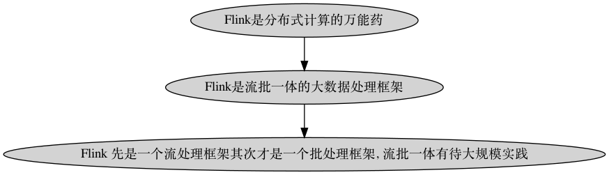
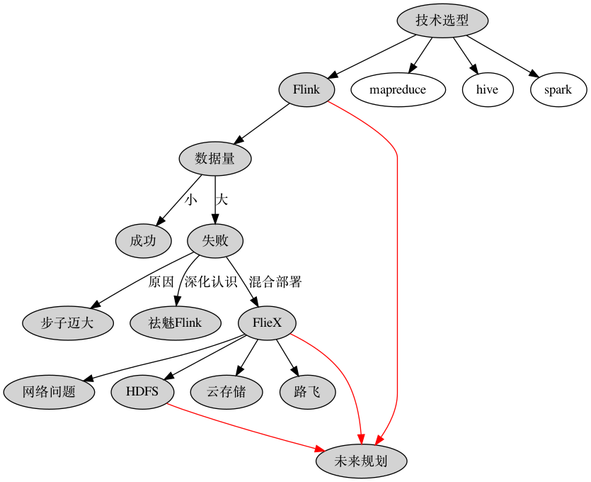

# Flink日志批处理实践-03

[Flink日志批处理系列](#Flink日志批处理系列)

+ [需求背景 把大象装进冰箱](#需求背景-把大象装进冰箱)
+ [Flink日志批处理系列01](#Flink日志批处理系列01)
+ [Flink日志批处理系列02](#Flink日志批处理系列02)

[多平台日志融合方案的衍变](#多平台日志融合方案的衍变)

+ [前期方案 步子迈大了](#前期方案-步子迈大了)
+ [现行方案 路一步一步走](#现行方案-路一步一步走)
+ [未来规划](#未来规划)

[总结](#总结)

[Q&A](#Q&A)

## Flink日志批处理系列

此次分享是 "Flink日志批处理系列" 的第三节, 主要是针对在 "Flink日志批处理系列02" 中暴露出来的问题进行修复和设计方案上的迭代. 考虑到有些同学之前没有关注过, 所以先简短交代下日志处理的需求背景和过去的实践.

### 需求背景-把大象装进冰箱

把大象装进冰箱需要三步, 同样日志融合也需要三步: 

1. 下载日志 ( Extra)
2.  处理日志 (Transform)
3.  上传日志 (Load)

所以这类问题也被统称为 "ETL".

### Flink日志批处理系列01

[技术选型：为什么批处理我们却选择了Flink](https://zhuanlan.zhihu.com/p/269484708). 这篇文章主要交代了选型 Flink 的背景, 以及当初做了哪些妥协. 

#### 大数据全家桶

这张图罗列一下大数据生态中常见的组件. Flink 宣称是 "流批一体的大数据计算框架", 反映在这张图上也就是 Pig 和 Spark 这两个组件所在的位置. 这里有一个问题, 在图中为什么 Spark, Storm 这些计算框架要画在 Hadoop 的上层呢? 更加直白来说, 计算框架和分布式系统有什么关系呢?针对这个问题, 后面会展开.

### Flink日志批处理系列02

"Flink 在又拍云日志批处理中的实践" ([视频版](http://shangzhibo.tv/watch/10230926), [文字版](https://zhuanlan.zhihu.com/p/352870794)). 

这个分享主要介绍了是 Flink 在落地初期的实践和尚未解决问题. 当时悬而未决的问题有:

#### 1.资源浪费

在量小的情况下资源是浪费的, 因为配置的资源是按照其峰值计算的.

[Flink 控制台](https://flink.s.upyun.com/#/overview)

[日志折线示意图](https://madoka.upyun.com/r/gifshow)

#### 2.容器上部署带来的网络问题

这张图的原始出处是 InfoQ 上阿里巴巴分享的文章 [Flink on K8s 实践经验总结：我们都踩过哪些坑？](https://www.infoq.cn/article/tk7f60t0kbt82oh0mka5). 这个问题的背景是 Flink 在 Luffy (又拍云内部使用的 K8S 平台) 上部署后, 当 Flink 处理的数据量变大时, 经常会遇到 Flink Job 抛出 "Connection reset by peer" 的问题. 我们参考了阿里巴巴给出的解决方案.  

---

## 多平台日志融合方案的衍变

### 前期方案-步子迈大了

#### 前期方案失败在哪?

前期的方案是把所有的日志文件都放在一个 Flink Job 中进行处理. 这个方案在小客户的多平台日志融合中表现良好, 但是在大客户的日志融合中完全行不通. 前期方案没有解决大数据量下日志融合问题, 与 Flink 大数据处理的初衷不符, 所以从结果上说是失败的.

#### 原因归纳

+ 对 Flink 认识不足, 把它当做 "黑盒" 或 "万能药" 妄图解决所有问题.
+ 用 Flink 进行批处理的时机不恰当:
  + "技术选型时选择 Flink" 就是一个折中的方案, 如果不受限于资源最优选择是 Hive.
  + Flink 批处理是阿里内部使用逐步添加到 Flink 的功能, 目前有许多地方待完善.
    + 关注 xx 号提案, [举例](https://issues.apache.org/jira/browse/FLINK-21670?jql=project%20%3D%20FLINK%20AND%20component%20%3D%20%22Build%20System%22) 
+ 预期过高 :
  + 使用 Flink 进行流处理.
  + Flink 支持使用 SQL 编写 Job 或者封装出简单的接口供外界调用. (做了不必要的抽象, 问题复杂化)
    + Flink SQL 相关接口.
  + 希望一步到位, 对 Flink 相关接口进行扩展: redis 读写, 又拍云存储读写, Pg 数据库读写.
+ 内部缺乏相关的生态 (借用某同学的话来说, "缺乏氛围" ):
  + 对 Java 相关缺乏了解: JVM, maven, netty, akka, mybaits, jredis 
  + 对大数据相关套件缺乏了解和建设: hdfs, nsq vs kafka, zookeeper vs etcd ...

#### 典型案例

+ Gifshow: Flink Job Manager 心跳超时, 原始数据加载失败.
+ Onepunch: Flink Task Manager 直接挂掉

#### 其他实践

+ 修复了一个 Flink 连接 Pg 的 Bug.
+ 发现又拍云云存储 java-sdk 上传时的 Bug.

---

### 现行方案-路一步一步走

#### 祛魅后的 Flink

#### FileX:日志处理框架

+ [需求背景:把大象装进冰箱](#需求背景:把大象装进冰箱)这个笑话的可取之处: 抹平不同的数据源, transformer 和运行环境之间的差异. 
+ FlieX 的基本架构. 详细信息参见: [日志处理项目: FileX](https://github.com/kougazhang/golang/blob/master/filex.md) 

#### 基于 FileX 的探索

+ 混合部署: 支持 local 和 remote 的 transformer.

+ 为缓解 [容器上部署带来的网络问题](#2.容器上部署带来的网络问题)
  + 原始日志按 5 分钟粒度切包
  + 大 Job 拆分成上千个小 Job, 流式处理文件.
  + redis 写入脏数据问题
  + 日志排序的问题

+ HDFS 是 [大数据全家桶](#大数据全家桶) 的基座:
  + 数据读写.
  + Flink 流式处理中的状态恢复.
+ 云存储:
  + 上传阈值调整: 150G -> 300G.
  + golang-sdk 并发断点上传后, 压缩文件解压失败和哈希值校验失败.
  + golang-sdk 相关接口调整.
+ Luffy: ceph-new-fs 的写入性能

### 未来规划

+ 隔离新的 HDFS 集群, 现有集群的目标和 Flink 集群目标不完全一致:
  + 速度 VS 稳定
  + 计算 VS 存储
+ Flink 以 yarn 模式部署.
  + 进一步解决网络问题.
  + 提高整体资源的利用率. (HDFS 节点的 CPU 可以充分利用)

## 总结

1. 使用 Flink 问题是简化了还是复杂了?
   + 在单机能处理的情况下问题确实复杂化了.
   + 在分布式处理的情况下不是最简单但是比较完善的工业级的解决方案.
2. 简化问题有助于选择判断, 细化问题才能在正确的选择下把事情做成.

## Q&A

